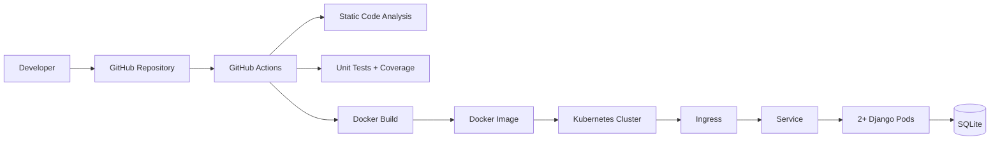

# Devsu Demo DevOps - Python

Repositorio de entrega para la prueba tecnica DevOps de Devsu.

Aplicacion base: `demo-devops-python`  
Stack utilizado: Python, Django REST Framework, Docker, GitHub Actions y Kubernetes.

## Objetivo

El objetivo del ejercicio es tomar una aplicacion base, dockerizarla, automatizar validaciones mediante un pipeline CI/CD y preparar los recursos necesarios para desplegarla en Kubernetes.

Esta entrega incluye:

- Dockerizacion de la aplicacion Django.
- Ejecucion con Gunicorn.
- Pipeline de CI con analisis estatico, tests, coverage y build de imagen Docker.
- Manifiestos Kubernetes para despliegue local.
- Replicas, recursos, health checks e HPA.
- Documentacion de ejecucion, despliegue y consideraciones de produccion.

## Arquitectura



## Componentes

- Aplicacion Django REST.
- Imagen Docker basada en `python:3.12-slim`.
- Servidor WSGI con Gunicorn.
- Healthcheck HTTP sobre `/api/`.
- Pipeline en GitHub Actions.
- Recursos Kubernetes:
  - Namespace
  - Deployment
  - Service
  - Ingress
  - Secret
  - HorizontalPodAutoscaler

## Requisitos

Para ejecutar el proyecto localmente:

- Python 3.12
- Docker
- Kubernetes local, por ejemplo Minikube o Docker Desktop
- kubectl
- NGINX Ingress Controller, si se desea probar el Ingress

## Variables de Entorno

| Variable | Descripcion | Ejemplo |
|---|---|---|
| `DJANGO_SECRET_KEY` | Secret key utilizada por Django | `local-secret` |
| `DATABASE_NAME` | Nombre del archivo SQLite | `db.sqlite3` |

Ejemplo local:

```bash
export DJANGO_SECRET_KEY=local-secret
export DATABASE_NAME=db.sqlite3
```

## Ejecucion Local

Instalar dependencias:

```bash
pip install -r requirements.txt
```

Ejecutar migraciones:

```bash
python manage.py makemigrations
python manage.py migrate
```

Ejecutar la aplicacion:

```bash
python manage.py runserver
```

Endpoint local:

```text
http://localhost:8000/api/
```

## Tests

Ejecutar tests unitarios:

```bash
python manage.py test
```

Ejecutar tests con coverage:

```bash
coverage run manage.py test
coverage report
```

## Docker

Construir imagen:

```bash
docker build -t devsu-demo-devops-python:latest .
```

Ejecutar contenedor:

```bash
docker run --rm \
  -p 8000:8000 \
  -e DJANGO_SECRET_KEY=local-secret \
  -e DATABASE_NAME=db.sqlite3 \
  devsu-demo-devops-python:latest
```

Validar endpoint:

```bash
curl http://localhost:8000/api/
```

Respuesta esperada:

```json
{
  "users": "http://localhost:8000/api/users/"
}
```

## CI/CD

El pipeline se encuentra en:

```text
.github/workflows/ci-cd.yml
```

Etapas implementadas:

1. Checkout del repositorio.
2. Configuracion de Python.
3. Instalacion de dependencias.
4. Analisis estatico con Flake8.
5. Ejecucion de tests unitarios.
6. Reporte de coverage.
7. Construccion de imagen Docker.

Link al pipeline:

```text
https://github.com/walterfontoura82/devsu-demo-devops0/actions
```

## Kubernetes

Los manifiestos se encuentran en:

```text
k8s/
```

Estructura:

```text
k8s/
├── namespace.yaml
└── app/
    ├── deployment.yaml
    ├── hpa.yaml
    ├── ingress.yaml
    ├── secret.yaml
    └── service.yaml
```

Aplicar recursos:

```bash
kubectl apply -f k8s/namespace.yaml
kubectl apply -f k8s/app/
```

Verificar recursos:

```bash
kubectl get pods -n devsu-demo
kubectl get svc -n devsu-demo
kubectl get ingress -n devsu-demo
kubectl get hpa -n devsu-demo
```

## Recursos Kubernetes Implementados

### Deployment

El deployment ejecuta la aplicacion Django con:

- 2 replicas.
- Imagen Docker de la aplicacion.
- Variables de entorno desde un Secret.
- Requests y limits de CPU/memoria.
- Readiness probe.
- Liveness probe.

### Service

El Service expone la aplicacion dentro del cluster usando `ClusterIP`.

### Ingress

El Ingress expone la aplicacion usando el host:

```text
devsu-demo.local
```

Para probarlo localmente, agregar en `/etc/hosts`:

```text
127.0.0.1 devsu-demo.local
```

### Horizontal Pod Autoscaler

El HPA configura escalamiento horizontal:

- Minimo: 2 replicas.
- Maximo: 5 replicas.
- Metrica: CPU promedio al 70%.

## API

### Crear Usuario

Endpoint:

```text
POST /api/users/
```

Body:

```json
{
  "dni": "12345678",
  "name": "Test User"
}
```

### Obtener Usuarios

Endpoint:

```text
GET /api/users/
```

### Obtener Usuario por ID

Endpoint:

```text
GET /api/users/<id>/
```

## Consideraciones de Produccion

Para un despliegue productivo se recomienda:

- Reemplazar SQLite por PostgreSQL o una base de datos administrada.
- Publicar la imagen en un registry externo como GHCR, DockerHub, ECR, GCR o ACR.
- Gestionar secretos con GitHub Secrets, External Secrets, Sealed Secrets o Vault.
- Desactivar `DEBUG`.
- Restringir `ALLOWED_HOSTS`.
- Configurar TLS en el Ingress.
- Asociar un dominio DNS real.
- Agregar monitoreo, metricas y logging centralizado.
- Agregar escaneo de vulnerabilidades en el pipeline.
- Definir una estrategia de migraciones de base de datos para despliegues.

## Limitaciones

El despliegue Kubernetes esta preparado para un entorno local como Minikube o Docker Desktop.

El pipeline actual construye la imagen Docker, pero no publica la imagen en un registry externo ni ejecuta el despliegue automatico a Kubernetes. Para completar esa parte en un entorno real se requiere configurar credenciales del registry y acceso seguro al cluster mediante secretos del proveedor elegido.

No se incluye infraestructura en un proveedor cloud mediante Terraform o CloudFormation, por lo tanto el punto extra de IaC queda fuera del alcance actual.

## Estructura del Proyecto

```text
.
├── .github/
│   └── workflows/
│       └── ci-cd.yml
├── api/
├── demo/
├── k8s/
│   ├── namespace.yaml
│   └── app/
│       ├── deployment.yaml
│       ├── hpa.yaml
│       ├── ingress.yaml
│       ├── secret.yaml
│       └── service.yaml
├── Dockerfile
├── manage.py
├── README.md
└── requirements.txt
```

## Evidencias

Repositorio:

```text
https://github.com/walterfontoura82/devsu-demo-devops0
```

Pipeline:

```text
https://github.com/walterfontoura82/devsu-demo-devops0/actions
```

Endpoint publico:

```text
No disponible. El despliegue fue preparado para ejecucion local en Kubernetes.
```
